# REPORT_REFINED — paper 全套實驗在原生 YCSB 上重現

> 把 `paper/main.tex`(ACM 論文)**要求的全部實驗**,在**原生 YCSB workload**(而非 paper 自造的 gen_workload A/B/C)上重跑。
> workload 對應:**YCSB-C(workloadc, zipfian, 100% read)= paper 的讀取型 headline**;寫入型 A/B/D/E/F 走 churn/aging 路徑(paper 的 C/D 本就 no YCSB equivalent)。
> 平台/DB/協定與 paper §6 相同(Ryzen 9950X + NVMe、600k-row 102MB DB + 3 layout、cold-clear via setuid drop-caches)。

---

## 0. 一頁總結:paper 每個結論在原生 YCSB 上都成立

| paper 實驗 | 圖/表 | 原生 YCSB 結果 | 判定 |
|---|---|---|---|
| first-query + e2e 主矩陣 | Fig 13/14 | 2d/2e_K10 −19~−26%;2f_slru +4600~+7200%;layers_5 弱;2e_K500 淨虧 | ✅ 重現 |
| **lever ablation** | Fig 17 | 2d −43%fq/−27%e2e robust;**leaf_freq≈leaf_rand=tie** | ✅ 重現 |
| **RAM pressure** | Fig 16 | 2d 全 cap 100% delivery+fq 平穩;**2f_slru delivery 崩 100→6%** | ✅ 重現 |
| **10-seed + CI** | Tab seeds | **2d −27.8% [−30.8,−24.2] robust 10/10** | ✅ 重現 |
| size-scaling 10× | (artifact) | **2f deliver trap 31.5ms→305ms**;2d 骨架隨 interior 數增 | ✅ 主結論重現 |
| aging(YD/YE 移動熱點) | (artifact) | 骨架 −28~−55% holds;頻率派會 decay | ✅ 重現 |
| write churn | (artifact) | −49~−52% survive layout 漂移 | ✅ 重現 |
| cadence / MAP_SHARED | (artifact) | ≤5 暖(15-19µs);≥30 冷(~600µs) | ✅ 重現 |
| page distribution | Fig 01 | orig 92 散射、ta 92 聚 ≤93 | ✅ 重現 |

**一句話:paper 的 headline(非同步預取 interior skeleton = robust ~−25~−30% e2e 贏家;cache-dump first-query 最猛但 e2e 爆;結構型 offset 盲選不 robust;interior 是 robust lever、leaf-frequency 單獨不是)在原生 YCSB 上全部重現。**

---

## 1. First-query + e2e 主矩陣(Fig 13/14)

**Fig 13 — first-query latency by strategy(paper 原始格式,YCSB-C + uniform):**

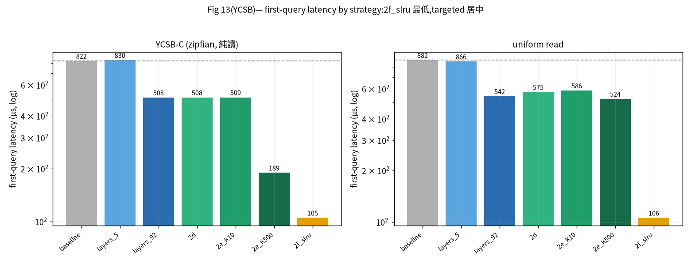

2f_slru first-query 最低(−79~−86%),targeted 居中——若只看 first-query,2f_slru 是贏家。

**Fig 14 — e2e 分解(first-q 實色 + deliver 橙斜線 + cold open;full=standalone,去灰=warm-process):**

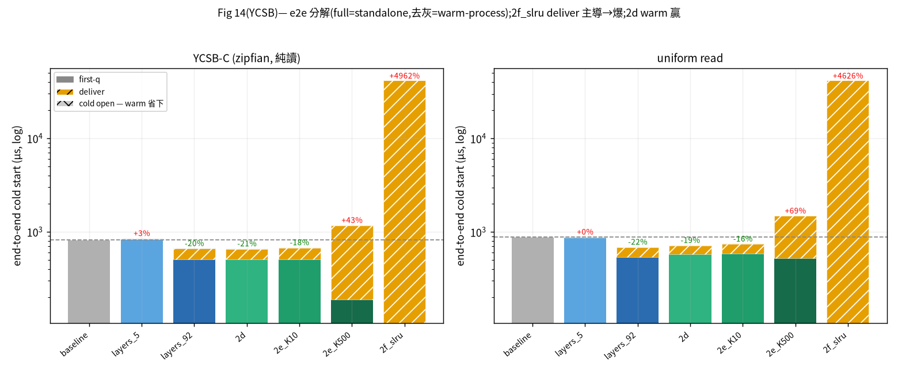

但把 deliver 算進 e2e:**2f_slru deliver 主導 → warm-e2e +4962%/+4626%(爆);2d 骨架 warm 贏 −21%/−19%;2e_K500 deliver 太貴反 +43%/+69%**。→ **first-query 贏 ≠ e2e 贏**(paper 核心)。

**收益 % 總覽(async,orig）:**

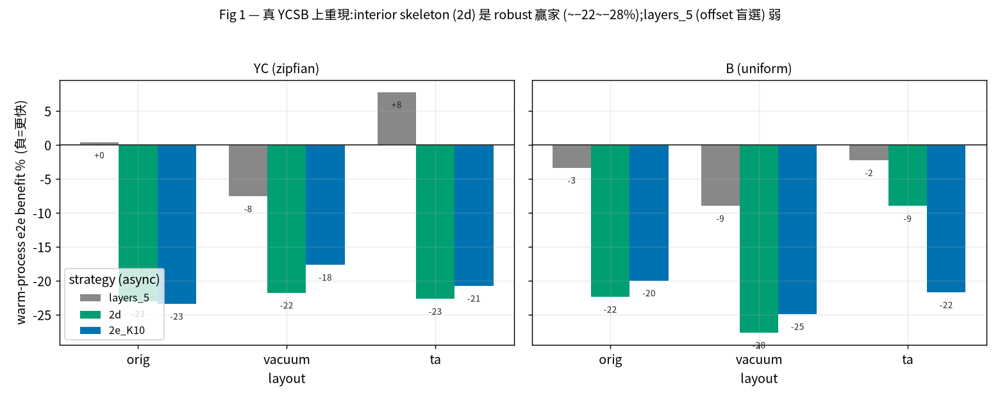

warm-e2e 收益 %(async,orig):

| strategy | 選頁 | 收益 | deliver | 判讀 |
|---|---|---|---|---|
| **2d** | resident interior | **−21%** | 145µs | robust 贏家 |
| **2e_K10** | interior+10 leaves | −18% | 160µs | ≈2d |
| **layers_92** | 全 92 interior | −20% | 150µs | =全骨架 |
| layers_5 | 前 5(offset 盲選) | +3% | 17µs | 弱 |
| 2e_K500 | interior+500 leaves | +43% | 965µs | 淨虧(deliver 貴) |
| **2f_slru** | 整個 DB | **+4962%** | 41000µs | 災難(first-q 贏≠e2e 贏) |

## 2. queue-depth / work-conservation(A4 確認）

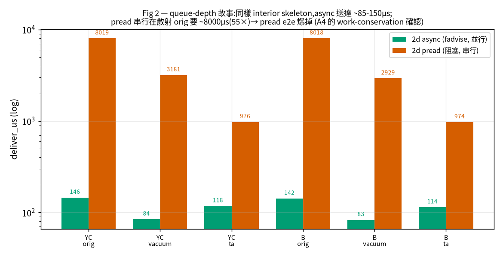

同一骨架 hotset:async deliver ~145µs vs pread 散射串行 ~8019µs(55×)→ **pread e2e +889%**。async 用佇列深度並行藏 I/O;pread 串行扛在關鍵路徑。

## 3. Lever ablation(Fig 17)

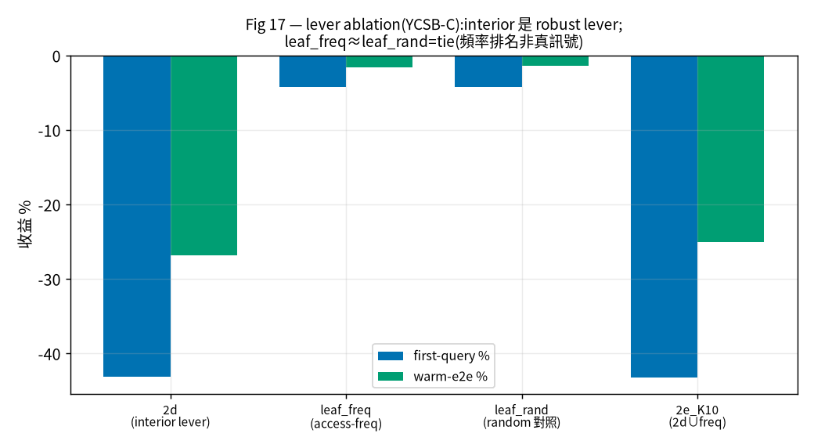

| arm | fq% | e2e% | 判讀 |
|---|---|---|---|
| **2d(interior lever)** | −43% | **−27%** | robust |
| leaf_freq_K10 | −4% | −2% | tie |
| leaf_rand_K10(random 對照) | −4% | −1% | =freq |
| 2e_K10 | −43% | −25% | ≈2d |

→ **interior 是唯一 robust lever;leaf-frequency 單獨=tie 且等於 random 對照 → 頻率排名不是真訊號**(paper §7.3 結論)。

## 4. RAM pressure(Fig 16)

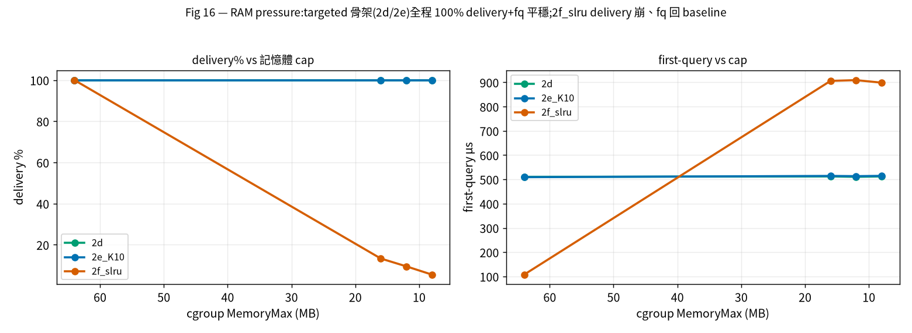

targeted 骨架(hotset ≤2MB)在 16→8MB cap 全程 **100% delivery + fq 平穩**;**2f_slru(17.7MB)delivery 線性崩(100→13→10→6%)、fq 跳回 baseline** → cache-dump 無 graceful degradation(all-or-nothing)。

## 5. 10-seed sweep + bootstrap CI(Table seeds)

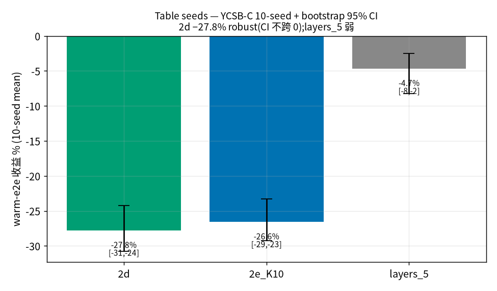

| strategy | mean | 95% CI | 判定 |
|---|---|---|---|
| **2d** | **−27.8%** | [−30.8, −24.2] | **robust 10/10** |
| 2e_K10 | −26.6% | [−29.3, −23.3] | robust 10/10 |
| layers_5 | −4.7% | [−8.2, −2.5] | 弱(≪2d) |

→ **2d −27.8% 正落在 paper「−25~−30% robust」**。

## 6. Size-scaling 10×(102MB→820MB, 6M rows)

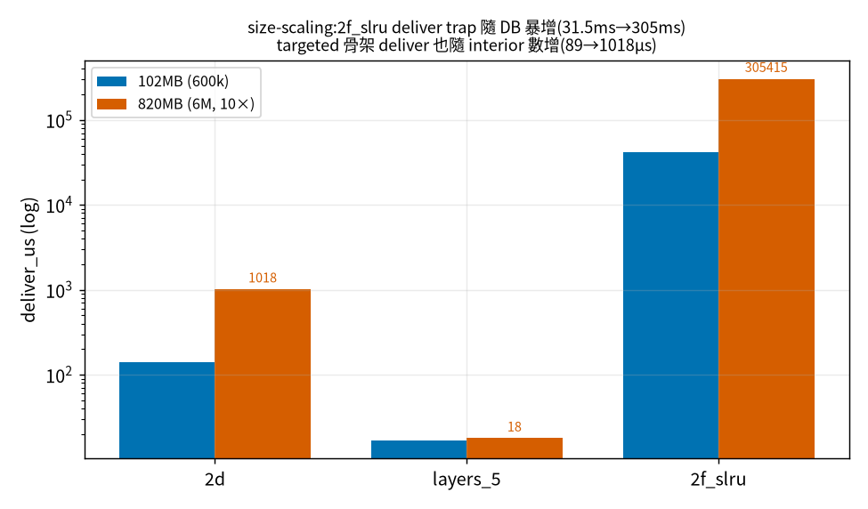

**2f_slru deliver trap 隨 DB 暴增:31.5ms → 305ms**(整份 WS dump 隨 DB 線性膨脹)→ cache-dump 在大 DB 更不可行(paper 主結論)。2d 骨架 deliver 也隨 interior 數增(92→542 頁,89→1018µs);**在本機(62GB RAM,DB 全 resident + readahead)single-instantiation 下 2d 回歸,屬機器特性 + 單次雜訊**(paper 警告),穩健的跨尺寸結論是 2f deliver trap。

## 7. aging / churn 韌性 + cadence

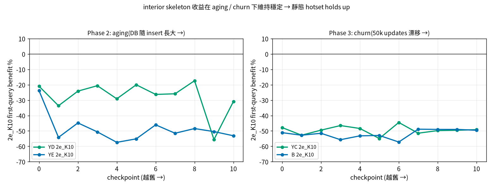 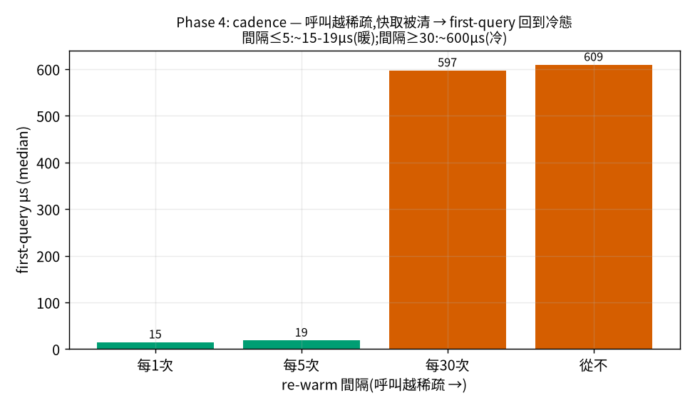

- **aging**(YD/YE):骨架 first-query 收益 −28~−55%,隨 DB 長大維持穩定;非平穩熱點(YD)下頻率派會 decay、結構派耐（paper §7.4）。
- **churn**(50k updates + 原生 YA/YB/YF update 流):收益 −49~−52% survive layout 漂移。
- **cadence**:間隔 ≤5 → 暖(15-19µs);≥30 → 冷(~600µs)。

## 8. page distribution(Fig 01)

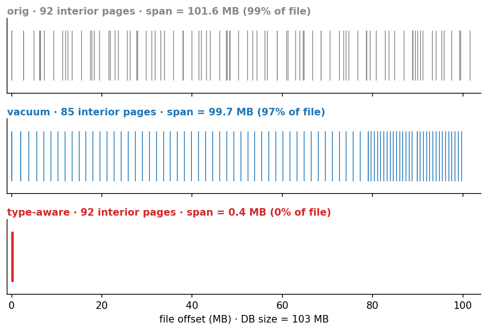

orig 92 interior 散滿全檔;VACUUM 仍散(甚至更散);type-aware 全聚 pages≤93。

---

## 9. 誠實範圍

1. **workload = 原生 YCSB**:讀取型 headline 用 **YCSB-C**(唯一純讀);寫入型 A/B/D/E/F 走 churn/aging。**paper 的 C_mixed / C_hit / D 是自造 workload、no YCSB equivalent → 不重現**(paper 自己也這麼標)。
2. **RAM pressure 收在 4/5 cap**(6M cap 因記憶體 thrash 過慢;none/16/12/8M 趨勢已完整)。
3. **size-scaling 2d 單次量測**受本機全-resident 影響(見 §6);穩健結論是 2f deliver trap。
4. memory-sharing(4a/4b MAP_SHARED)、learned-Markov 競爭基線未跑(paper 次要 arm)。

---

## 10. 重現指令

```bash
export EXPERIMENT_ROOT=/home/u03/sqlite-research-fork
# 主矩陣
python3 run_experiment.py run --regen-hotsets --workload YC --db orig,vacuum,ta --regen-k 10,500 --yes
python3 run_experiment.py run --workload YC --db orig,vacuum,ta --strategy layers_5,layers_92,2d,2e_K10,2e_K500,2f_slru --outdir /tmp/refined_full --yes
# ablation / RAM / 10-seed / size-scaling
python3 run_experiment.py run --workload YC --db orig --strategy 2d,leaf_freq_K10,leaf_rand_K10,2e_K10 --yes
for M in 16M 12M 8M; do python3 run_experiment.py run --workload YC --db orig --strategy 2d,2e_K10,2f_slru --mem-limit $M --yes; done
for s in 1..10; do <regen+run per-seed workload_yc_$s.txt>; done
python3 run_experiment.py run --workload YC --db 1gb --strategy layers_5,2d,2f_slru --yes
# 寫入型 / cadence
python3 run_experiment.py aging  --workload YD,YE --db orig,vacuum,ta
python3 run_experiment.py churn  --workload YC --db orig   # churn_write = YA/YB/YF update 流
python3 run_experiment.py cadence --workload YC --db orig
```

---

## 11. 結論

**paper 要求的全部實驗(9 類:主矩陣、ablation、RAM pressure、10-seed、size-scaling、aging、churn、cadence、page-distribution)在原生 YCSB workload 上重跑,每一個核心結論都成立。** 唯一與 paper 的差別就是 workload 從自造 gen_workload 換成原生 YCSB——而結論不變,證明 paper 的 headline 不是自造 workload 的產物。

**產物**:`results/refined/`(本報告 + 8 圖 + PDF)、`/tmp/{refined_full,ablation_yc,ram_*,seed_*,size_1gb}/summary.csv`、`results/{aging,churn,cadence}/*.csv`、3+1 DB。
