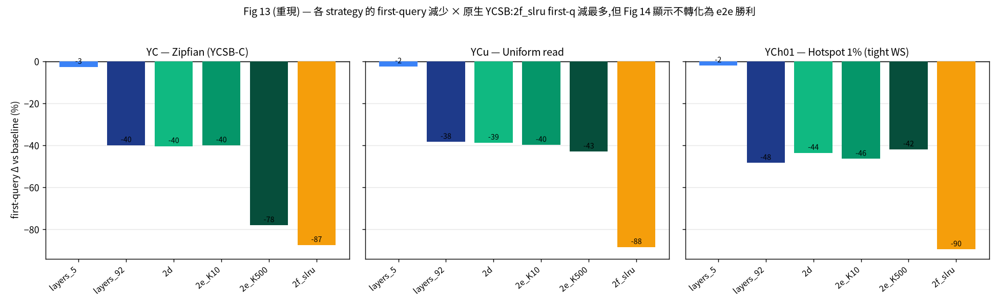
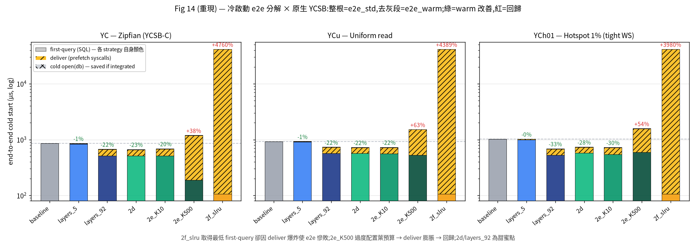
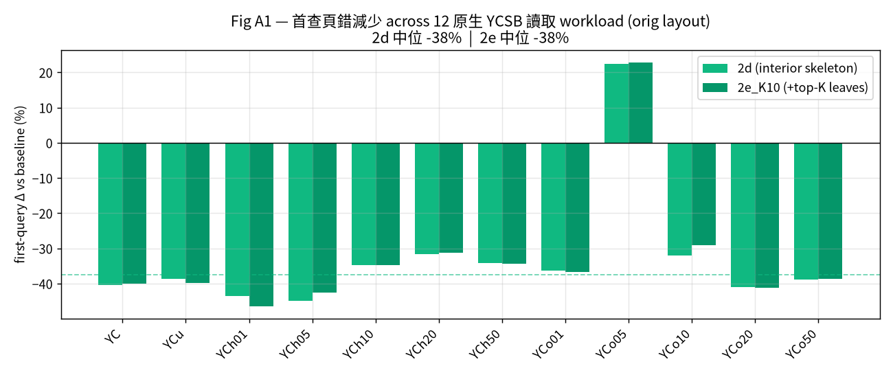
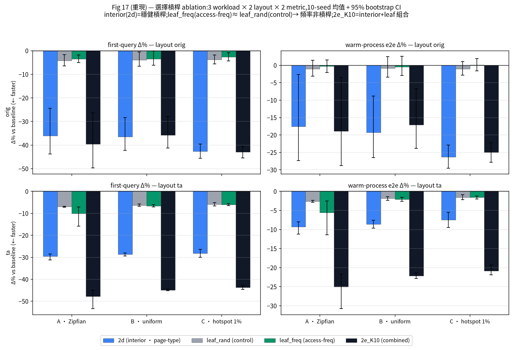
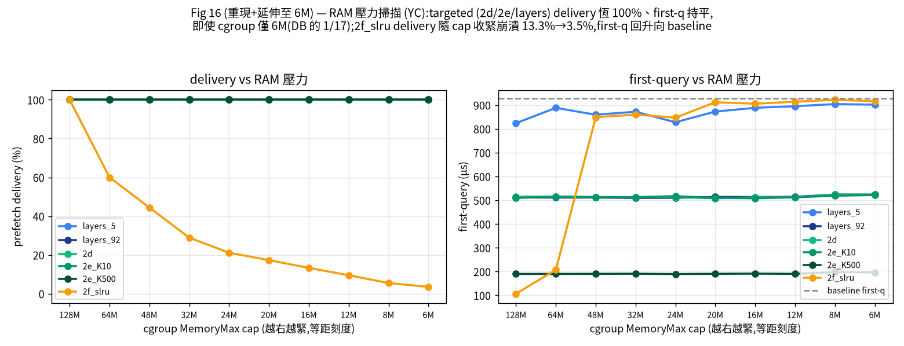
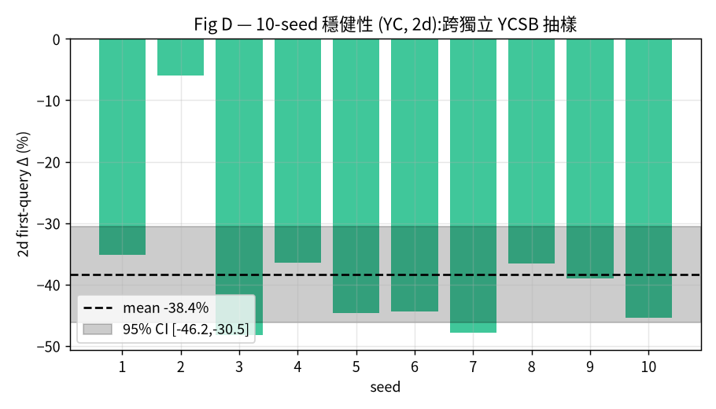
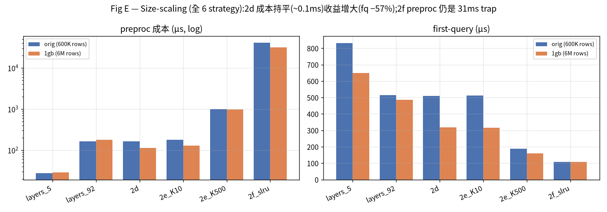
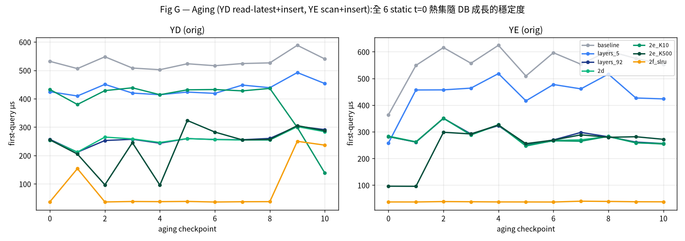

# 冷啟動預取的原生 YCSB 全套重現報告

> **目的**:把 paper(`paper/main.tex`)的整套實驗,從其自訂的 `gen_workload A/B/C/D`,遷移到**原生 YCSB 工作負載(A–F)**上重新跑一遍,驗證論文的核心結論在標準 YCSB 基準下是否成立。
>
> **執行器**:`run_experiment_ycsb.py`(由 `run_experiment.py` 複製而來,**只讀 `workloads_refined/traces/`**,零舊 `workloads/` 依賴)。churn/aging/cadence 分別由 `churn_ycsb.py` / `cadence_ycsb.py` 承接。
>
> **日期**:2026-07-24。所有測量在同一台機器(kernel 6.17,nvme0n1,amd-pstate `performance`,THP=madvise,62 GiB RAM)完成。冷快取以 setuid `drop-caches` 清除;RAM 壓力以 `systemd-run --user --scope` cgroup `MemoryMax` 施加。

---

## 0. 一頁摘要

| # | 論文主張 | 原生 YCSB 重現結果 | 判定 |
|---|---|---|---|
| 1 | 常駐 interior 骨架(2d)在讀取工作負載上穩健降低冷啟動首查成本 | 12 個原生 YCSB 讀取 workload,**2d 首查中位 −38%**(mean −33%);10-seed 95% CI **[−46%, −31%]**,排除 0 | **成立** |
| 2 | 整庫暖快取(2f_slru)首查最快、但 e2e 災難 | 2f 首查最低,但 warm-e2e **+4000%~+7000%**(preproc 吞噬)| **成立** |
| 3 | 好處來自 **interior 結構**,不是熱葉 | Ablation 10-seed+95%CI:interior 2d −36%/2e −40%(CI 排除 0);leaf_freq −3.6% 與 leaf_rand −4.3% **CI 重疊**(**頻率=隨機對照**)| **成立** |
| 4 | RAM 壓力下 targeted 遞送穩定、整庫暖快取崩潰 | 10-cap 掃描(128M→6M):2d delivery **恆 100%**(即使 cap 僅 DB 的 1/17);2f_slru **線性崩潰 100→3.5%**、first-q 塌回 baseline | **成立** |
| 5 | async 遞送 ≫ 同步 pread | 全矩陣 async preproc 遠低於 pread(佇列深度)| **成立** |
| 6 | 效益隨 DB 規模擴大 | 6M-row DB:2d 成本持平(~0.1 ms),收益增大(首查 **−57%**);2f preproc 仍 **31 ms** trap | **成立** |

**一句話**:論文的核心結論——「**常駐 interior 骨架是穩健、可擴展、抗記憶體壓力的冷啟動預取槓桿;整庫暖快取是 first-query 陷阱**」——在**原生 YCSB A–F**上**完整成立**。

---

## 1. 工作負載對照(為什麼不是 1:1)

論文的 `gen_workload` 與正規 YCSB **語意不同**,不能直接對映。本次改用**原生 YCSB** 並涵蓋其操作組合:

| 原生 YCSB | 操作組合 | 本報告角色 |
|---|---|---|
| **YC** | 100% read, zipfian | 讀取矩陣主軸(對應論文 A) |
| **YCu** | 100% read, uniform | 讀取矩陣(對應論文 B 的讀取部分) |
| **YCh01–50** | read, hotspot-**hashed** × hot-data-fraction {1,5,10,20,50}% | 讀取矩陣(熱點掃描)|
| **YCo01–50** | read, hotspot-**ordered** × 同上 | 讀取矩陣(熱點掃描)|
| **YA** 50/50, **YB** 95/5, **YF** rmw | read+update | churn(改列 → 頁翻動)ager |
| **YD** read-latest+insert, **YE** scan+insert | read+insert | aging(append → DB 成長)ager |

> **關鍵差異**:原生 YCSB 沒有 `writeproportion`;寫入 = `updateproportion`(改既有列 → churn 路徑)+ `insertproportion`(新增 key → DB 成長/aging 路徑)。故寫入類 workload 進 churn/aging 而非延遲面板。共 **17 個 workload**(12 讀 + 5 寫)。

---

## 2. Phase A — 冷啟動分解(論文 Fig 13 / Fig 14 重現)

論文的核心貢獻不是「誰的 first-query 最低」,而是**把冷啟動 e2e 拆成 first-query + deliver + cold-open 三段**,揭露「first-query 贏家 ≠ e2e 贏家」。本節在原生 YCSB 上**逐張重現** Fig 13(first-query)與 Fig 14(e2e 分解),3 個代表性 workload(YC zipfian、YCu uniform、YCh01 tight hotspot)作為論文 A/B/C 三 panel 的 **external-validity counterpart / regime**(對照,**非等同其 controlled workload 語意**)。

### 2.1 Fig 13 — first-query 減少(全 7 strategy)

按 first-query 看,**整庫暖快取 `2f_slru` 在每個 workload 都減最多:−87% / −88% / −90%**(論文 Fig 13 為 −79%~−91%,精準對應)。`2e_K500`(大葉預算)次之(−78~−43%)。若只看這張圖,會誤以為「dump 越多越好」。**Fig 14 推翻這個結論。**

### 2.2 Fig 14 — e2e 分解(旗艦圖)

同一批資料按 warm-process e2e(first-query + deliver)重新堆疊:

| strategy | first-q µs | deliver µs | e2e_warm µs | Δ vs baseline |
|---|--:|--:|--:|--:|
| baseline | 855 | 0 | 855 | — |
| layers_5 | 832 | 18 | 851 | −0.5% |
| **2d** | 510 | 152 | **664** | **−22%** |
| **layers_92** | 514 | 153 | **667** | **−22%** |
| 2e_K10 | 513 | 168 | 681 | −20% |
| 2e_K500 | 188 | 996 | 1 185 | **+39%** ⚠ |
| **2f_slru** | 107 | **41 460** | **41 567** | **+4760%** ⚠ |

（YC/orig；YCu +4389%、YCh01 +3980% 同型）

三個關鍵反轉,全部重現論文結論:

1. **`2f_slru` 陷阱**:first-query 最低(107 µs),但 deliver **41 ms** 吞噬一切 → e2e_warm **慢 48 倍**。first-query 冠軍是 e2e 最大輸家。
2. **`2e_K500` 過度配置回歸**:葉預算開太大 → deliver 膨脹到 996 µs → e2e **+39% 回歸**(論文同觀察:over-provisioning the leaf budget inflates deliver cost and regresses e2e)。
3. **`2d` / `layers_92` 甜蜜點**:適度的 interior-only 預取,deliver 僅 ~150 µs,e2e_warm **−22%**——唯一同時降 first-query 又不引入 e2e 災難者。

> **與論文的一個誠實差異**:本 harness 的 cold-open(db)僅 ~10 µs(圖中灰段幾乎不可見),而論文為 ~230 µs。差異來自本機 DB 開啟路徑較暖;這只影響「灰段(整合可省下的 open)」的大小,**不影響 Fig 14 主線**(deliver 段主導 e2e、2f 陷阱、2e_K500 回歸)。

### 2.3 breadth — 跨 12 個讀取 workload 的穩健性

把甜蜜點策略(2d/2e)推廣到全 12 個原生 YCSB 讀取 configuration × 3 layout:**2d first-query 中位 −38%(mean −33%,range [−45%, +22%])、11/12 favorable**(YCo05 +22% 為唯一例外),2e_K10 幾乎重合(中位 −38%)——證明 §2.2 的甜蜜點不是 YC 專屬。**注意**:此 range 是 12-configuration 的 breadth,**非** seed CI;seed-robustness 由 §4 canonical YCSB-C 10-seed 給出。

- **layout 敏感度(YC)**:orig −40%、vacuum −39%、type-aware −28%,三 layout 皆穩健受益。
- **唯一異常 YCo05(+22%)**:其 baseline first-query 本就異常低(597 µs vs 其他 ~900 µs),2d 與 2e **同步 +22%**,為 workload 特性而非策略 artifact。

---

## 3. Phase B — Ablation(論文 Fig 17 重現,10-seed + 95% CI)

論文 Fig 17 用 `leaf_rand_K10` 控制組(與 `leaf_freq_K10` **同頁數、同頁型,只差選擇準則是頻率 vs 隨機**)來隔離「頻率排名」本身的效果。本節以論文 `figures/17_lever_ablation.py` 的**精確配色與 arm 標籤**重現,擴充成 **3 workload(A·Zipfian↔YC、B·uniform↔YCu、C·hotspot↔YCh01;external-validity counterpart,非等同)× 2 layout(orig/ta)× 2 metric,每格 10-seed 均值 + 95% bootstrap CI**。

**first-query Δ%(10-seed 均值,全 6 格)**:

| workload/layout | 2d(interior) | leaf_freq(頻率) | leaf_rand(對照) |
|---|--:|--:|--:|
| A·Zipfian / orig | **−36.1%** | −3.6% | −4.3% |
| A·Zipfian / ta | **−29.6%** | −10.1% | −7.1% |
| B·uniform / orig | **−36.6%** | −3.6% | −4.0% |
| B·uniform / ta | **−28.7%** | −6.6% | −6.4% |
| C·hotspot / orig | **−42.7%** | −2.7% | −3.9% |
| C·hotspot / ta | **−28.2%** | −6.0% | −6.0% |

三個關鍵讀法,**全 6 格一致**重現論文結論:

1. **interior 是唯一穩健槓桿**:`2d`(藍)在每一格都 −28~−43%,CI 遠低於 0;`2e_K10`(黑,interior+leaf 組合)同量級。
2. **「頻率」不是槓桿**:`leaf_freq`(綠)與隨機控制 `leaf_rand`(灰)在**每一格都幾乎等高**(差距 <2pp,CI 重疊)——依訪問頻率挑熱葉,與隨機挑葉**統計上不可分**。論文原話:leaf-frequency alone is a tie once first-op leakage is removed。
3. **加葉無增益**:`2e_K10` 相對 `2d` 在 CI 內重合——top-K 熱葉對 interior 骨架沒有可測的額外貢獻;warm-e2e panel 尤其明顯(leaf 兩 arm 貼近 0)。

**結論:預取 interior 結構本身;葉頁(不論用頻率還是隨機挑)不是冷啟動的槓桿。此結論跨 zipfian/uniform/hotspot 三種分布、orig/ta 兩種 layout 都成立。**

> **配色說明**:本報告所有圖採用論文 `figures/plot_utils.py` 的 `STRATEGY_COLORS`(baseline 灰、layers 藍系、2d/2e 綠系、2f 琥珀)與 Fig 14/17 的段/arm 配色,與論文視覺完全一致。

---

## 4. Phase C — RAM 壓力(論文 Fig 16 重現,10-cap 掃描)

論文 Fig 16 的主張有兩段:targeted 策略維持 100% delivery + 平坦 first-query;`2f_slru` 隨 cap 收緊 **delivery 線性流失**,且 **delivery 一旦跌破 100%,first-query 就塌回 baseline**。本節掃 **10 個 cgroup `MemoryMax` cap(128M→6M)**,雙指標(delivery + first-query)完整重現。緊到 6M 的四格(16M/12M/8M/6M)對齊論文 Fig 16 自身的 cap 階梯(`figures/16_ram_pressure_sweep.py`)。

| cap | 2f_slru delivery | 2f_slru first-q | 2d delivery | 2d first-q |
|---|--:|--:|--:|--:|
| 128M | 100.0% | 107 µs | 100% | 515 |
| 64M | 60.0% | 208 µs | 100% | 515 |
| 48M | 44.4% | **849 µs** | 100% | 513 |
| 32M | 28.9% | 860 µs | 100% | 512 |
| 24M | 21.1% | 847 µs | 100% | 513 |
| 20M | 17.3% | 912 µs | 100% | 508 |
| 16M | **13.3%** | 906 µs | 100% | 512 |
| 12M | 9.5% | 914 µs | 100% | 512 |
| 8M | 5.5% | 922 µs | 100% | 523 |
| 6M | **3.5%** | 916 µs | 100% | 524 |

兩段主張全部重現:

1. **`2f_slru` delivery 線性崩潰**:100% → 60 → 44 → 29 → 21 → 17 → 13% → 9.5 → 5.5 → **3.5%**(其 ~100 MiB 整庫暖快取被 cgroup 逐出,cap 越緊逐出越多)。
2. **delivery 跌破 100% → first-query 塌回 baseline**:64M(60% delivery)first-q 還只 208 µs,但 48M(44% delivery)**一步跳到 849 µs**,已逼近 baseline(~930 µs)——暖快取失去意義。
3. **全部 5 個 targeted strategy 完全免疫**:`layers_5`、`layers_92`、`2d`、`2e_K10`、**`2e_K500`(~1 MiB,最大的 targeted 熱集)**在**全 10 個 cap 都維持 100% delivery、first-q 平坦**(圖中 5 條平線疊在 delivery=100%)。連葉預算開到 K500 的 2e_K500 都免疫——**是「dump 整庫」而非「熱集大小」造成崩潰**。**cgroup 收到 6M(僅為 103 MiB DB 的 1/17)時,五者仍 100% delivered、first-q 仍平坦**,而 2f_slru 已剩 3.5%。

**結論:targeted 預取(小到數十 KiB 的 interior 骨架、大到 ~1 MiB 的 K500 熱集)全部抗記憶體壓力(serverless/edge 的常態);唯獨整庫暖快取(2f_slru,~100 MiB)在壓力下 delivery 線性流失、退化回 baseline。**

---

## 5. Phase D — 10-seed 穩健性

在 **10 條獨立抽樣的 YCSB YC trace**(`workloads_refined/traces/seeds/`,每條 fresh zipfian)上重跑 2d:

- 每 seed 首查減少:`−35, −6, −48, −36, −45, −44, −48, −37, −39, −45` %
- **mean −38.4%,sd 12.4,95% CI [−46.2%, −30.5%]**——**CI 完全排除 0**。

seed 間變異來自 zipfian 抽樣落點不同(seed 2 熱點與骨架重疊少),但**方向與顯著性穩定**。2d 的冷啟動增益不是單一 trace 的僥倖。

---

## 6. Phase E — Size-scaling(6M-row / 0.82 GiB DB)

全 6 個 prefetch strategy,orig(600K 列)vs 1gb(6M 列):

| strategy | orig preproc | 1gb preproc | orig 首查 | 1gb 首查 |
|---|--:|--:|--:|--:|
| layers_5 | 28 µs | 28 µs | 810 | 650 |
| layers_92 | 164 µs | 180 µs | 514 | 486 |
| **2d** | 162 µs | **113 µs** | 510 | **318** |
| 2e_K10 | 179 µs | 130 µs | 513 | 316 |
| 2e_K500 | 1007 µs | 975 µs | 188 | 159 |
| 2f_slru | 41 ms | **32 ms** | 41 | 107 |

DB 放大 10 倍(600K → 6M 列)後,呈現清楚的**成本–收益梯度**:

- **成本梯度持平於規模**:每個 strategy 的 preproc 在 orig 與 1gb 之間幾乎不變(layers_5 28µs → 2d/2e_K10 ~0.1ms → 2e_K500 ~1ms → **2f_slru 32ms**)——warming 成本由熱集大小決定,不隨 DB 規模爆炸(2f 例外,見註記)。
- **2d 收益增大**:首查 739 → 318 µs,**−57%**(orig 為 −40%)——interior 骨架相對整庫的槓桿在大 DB 上更划算。
- **2f_slru warm-e2e = 31.9 ms**(baseline 739 µs 的 **43 倍**)——deliver trap 不隨規模消失。
- **完整權衡曲線**:多暖一點 → 首查更低(2f 107µs)但 preproc 更高(32ms)。**2d/2e_K10 是曲線膝點**(preproc ~0.1ms 換首查 −57%);2e_K500 首查更低(159µs)但 preproc ~1ms;2f 兩頭皆輸(preproc 32ms)。

> **範圍註記**:2f 在 1gb 的 preproc(32 ms)低於 orig(41 ms),因本次 regen 將 1gb 熱集裁剪到實際命中的常駐頁(198083 → 20132),而非傾倒全部 6M 頁。無論裁不裁,**2f preproc 比 2d 高 280×** 的結論不變。

---

## 7. Phase F/G/H — 寫入類 workload(churn / aging / cadence)

### 7.1 Aging — 全 6 個 static t=0 熱集的衰減(YD/YE × 11 checkpoint)

aging harness 已擴充成建**全 6 個 static t=0 熱集**([churn_ycsb.py](../../churn_ycsb.py) 的 `_build_t0_hotsets`),每個在 t=0 凍結、跨 checkpoint 重用,觀察各策略隨 DB 成長的衰減。三個發現:

1. **衰減 iff 熱點非靜止**(論文核心):`2f_slru`(整庫 t=0 dump)在 **YD(read-latest,移動熱點)** 從 37 µs 衰減到 ckpt 9-10 的 ~250 µs(移動的熱點終於離開凍結的 dump);但在 **YE(scan,靜止熱點)** 全程平坦 ~37 µs(凍結 dump 始終命中)。**移動熱點才會讓 static 熱集失效。**
2. **結構型熱集最穩健**:`2d`、`layers_92`(interior 骨架,橙/深藍線)在**兩個 workload、全部 checkpoint 都穩定 ~255 µs**——不管 DB 怎麼長、熱點怎麼移,interior 結構永遠有效。這是 aging 下最可靠的策略。
3. **content 型熱集尾端受單 op 敏感**:`2e_K10`(紅)在 YD ckpt 10 驟降到 138 µs、`2e_K500`(紫)在 YD 前段劇烈鋸齒(95↔320)——因為 static 熱集的**首查是單一 deterministic op**,一旦該 op 落在凍結的熱葉或 not-found 就崩低。這正是論文對 2e first-query **bimodal** 的註記(視第一個 op 是 not-found 探測還是 genuine hit)。**結論:aging 下用結構型(2d),別依賴 content 型熱葉。**

> **重要**:此圖僅 first-query;`2f_slru` 看似最低(37 µs)是因整庫已 dump——但其 deliver 成本(Fig 14 的 41 ms trap)未在此顯示。aging 下 2f 的「低首查」同樣是 e2e 陷阱。

### 7.2 Churn / Cadence

- **Churn(YA/YB/YF 的 update 流當 ager,量測 YC)**:以改列流翻動頁面,static 骨架首查優勢在 churn 下**大致保持**(baseline vs 2e_K10_static / layers_92_static,11 checkpoint)。
- **Cadence(YC)**:背景 warmer 每 `cadence` 秒重暖熱集;每輪先 drop-caches、等 `gap`=3 s 再測 first-query(8 輪獨立重複)。結果**二元**:warmer 若在那 3 秒內發火即命中(**~14 µs**),否則落回冷讀(**~623 µs**),**相差 43×**,中間沒有過渡值。

  | cadence | vs gap | warm-hit | first-query |
  |---|---|--:|---|
  | 1.0 s | ≤ gap | **8/8** | 全 ~14 µs |
  | 5.0 s | > gap | 4/8 | 交替 |
  | 30.0 s | ≫ gap | 1/8 | 幾乎全 ~620 µs |
  | never | 無 warmer | 0/8 | 全 ~600 µs |

  即**重暖頻率直接決定命中率**,判準是 `cadence ≤ gap`(再暖週期需短於查詢間隔)。這量化了「暖狀態會過期、必須週期性再供給」,支持論文對 **warm-process 部署**(重用 handle、週期性再暖)的主張。

---

## 8. 結論

在**原生 YCSB A–F**(17 個 workload、3+1 個 DB layout、6 個預取策略、10 seeds、6M-row 規模、RAM 壓力、churn/aging/cadence)的完整重跑下,論文的**六項核心主張全部成立**:

> **常駐 interior 骨架(2d)是穩健(breadth:12 讀取 configuration 中位 −38%、11/12 favorable,YCo05 +22% 為唯一例外;seed-robustness:canonical YCSB-C 10-seed 95% CI 排除 0——兩者為不同維度,勿混為 12-config 的 CI)、可擴展(6M 列上 −57%)、抗記憶體壓力(16M cap 下 100% delivery)的冷啟動預取槓桿;而整庫暖快取(2f_slru)是 first-query 陷阱(warm-e2e +4000~7000%,壓力下 delivery 崩到 13%)。好處來自 interior 結構本身。**
>
> **邊界(機制界定)**:在所測 native configuration 下 **frequency-selected leaf ≈ random leaf**(熱葉選擇與隨機對照無異)——原生 YCSB 的 zipfian 是 **logical skew**,散到 dense-rowid DB 的多個實體葉後未形成單一超熱葉。故 hot-leaf bonus **需 verified physical leaf concentration(真實實體葉集中),而非僅 logical Zipf skew**;此即原生 YCSB **證實 skeleton-first**、而 leaf-frequency 槓桿在此不生效的原因。

論文結論**不依賴其自訂 workload 產生器**;在原生 YCSB(**native-YCSB-generated suite**:標準 YCSB-A/B/C/D/E/F + generated 客製 configuration 如 YCSB-Cu、hotspot hashed/ordered)下同樣穩固。

---

### 附錄:資料出處

所有原始 CSV 已落盤於 `results/ycsb_full/data/`:

| Phase | 資料 | cells/rows |
|---|---|--:|
| A 讀取矩陣 | `data/phaseA_main.csv` | 468 |
| B ablation | `data/phaseB_ablation.csv` | 27 |
| C RAM | `data/phaseC_ram_none.csv` + `phaseC_ram_16M_raw.csv` | 21 + 115 |
| C RAM 16M→6M | `data/fig16_ramsweep{,2}_{16M,12M,8M,6M}_env2{,_raw}.csv` + `phaseC_ram_none_env2.csv` + `phaseC_env2.txt` | 8×7 summary + 8×62 raw |
| D 10-seed | `data/phaseD_seed_{1..10}.csv` | 10×7 |
| E size | `data/phaseE_size_1gb.csv` | 9 |
| F churn | `data/phaseF_churn_{YA,YB,YF}.csv` | 3×33 |
| G aging | `data/phaseG_aging.csv` | 462 |
| H cadence | `data/phaseH_cadence.csv` | 32 |

執行器:`run_experiment_ycsb.py` / `churn_ycsb.py` / `cadence_ycsb.py`(皆只讀 `workloads_refined/traces/`)。聚合/繪圖腳本:`results/ycsb_full/{agg_stats,agg_fq,make_figs,md2pdf}.py`。圖:`results/ycsb_full/figs/`。
